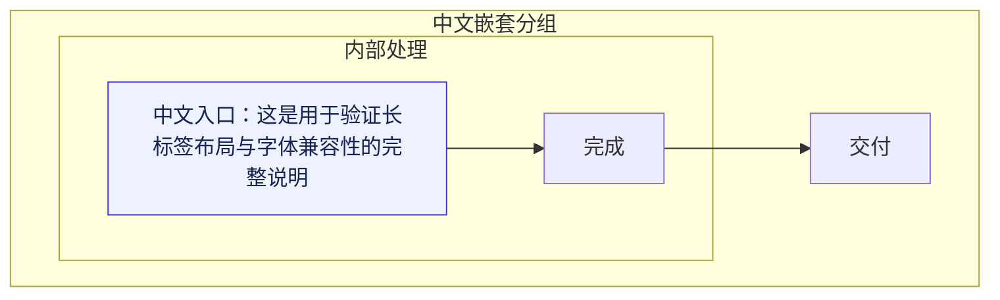
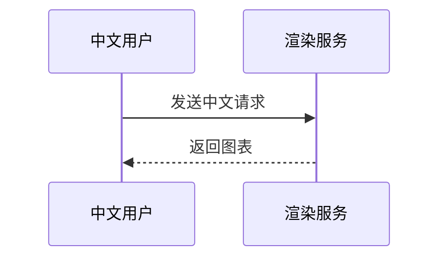
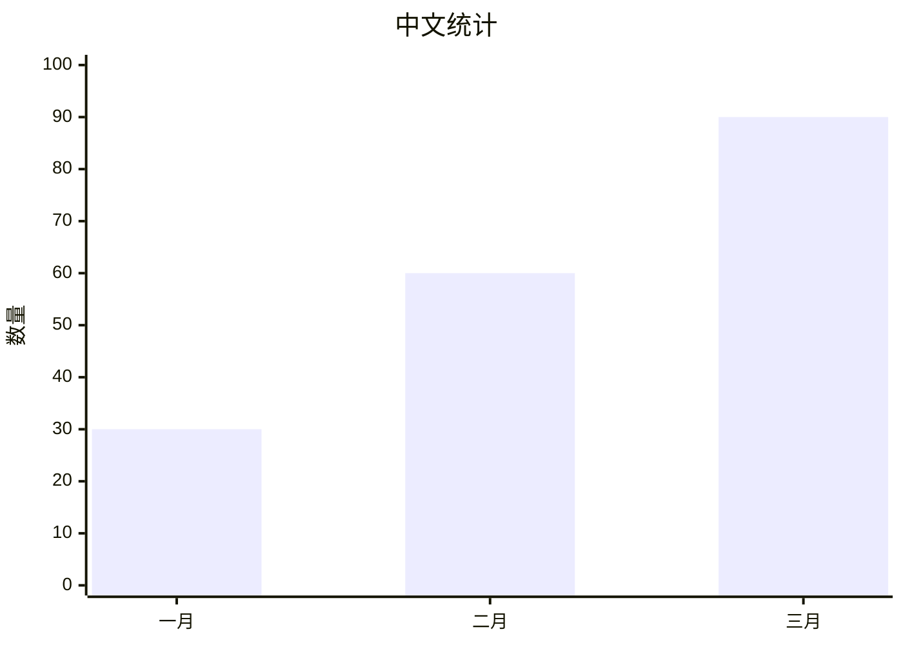

# Pele 真实环境验收

```mermaid
flowchart TD
  subgraph outer[中文嵌套分组]
    subgraph inner[内部处理]
      A[中文入口：这是用于验证长标签布局与字体兼容性的完整说明] --> B[完成]
    end
    B --> C[交付]
  end
  classDef fixed fill:#eef2ff,stroke:#4338ca,color:#172554
  class A fixed
```

```mermaid
sequenceDiagram
  participant U as 中文用户
  participant S as 渲染服务
  U->>S: 发送中文请求
  S-->>U: 返回图表
```

```mermaid
xychart-beta
  title "中文统计"
  x-axis ["一月", "二月", "三月"]
  y-axis "数量" 0 --> 100
  bar [30, 60, 90]
```
